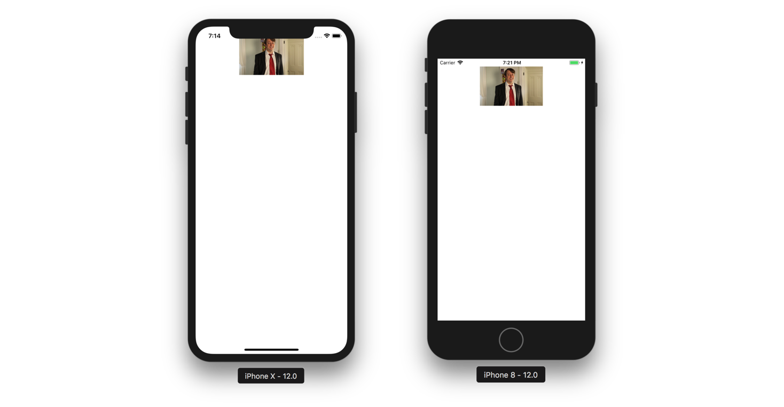
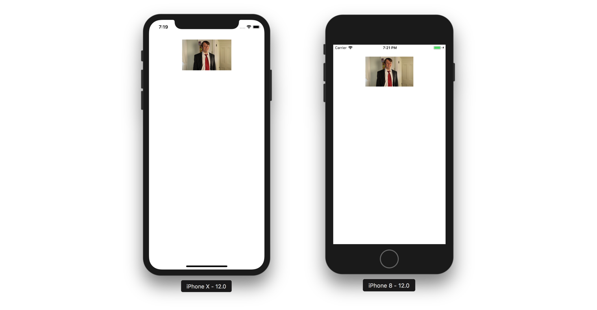

I've been using this pattern on the last couple of large projects I've worked to help split up the dreaded Massive View Controller issue, that we as iOS developers are famous for. You can view the finished project on [github](https://github.com/wtsnz/generic-viewcontroller) too.

This technique allows you to specify the type of `UIView` that a `UIViewController` loads in a type safe way, allows you to keep all the layout code to the view, and helps separate the *View* and *Controller* aspects of the view controller that often get blended together. 

I'll start with a little bit of a story as to how we got there, touching on Generics, Protocols & Autolayout.

```swift
open class GenericViewController<V: UIView>: UIViewController {
    override open func loadView() {
        self.view = V()
    }
}
```

Which allows you to then create your Profile View Controller:

```swift
class ProfileView: UIView {
    
}

class ProfileViewController: GenericViewController<ProfileView> {
    
    override func viewDidLoad() {
        super.viewDidLoad()
    }
    
}
```

Now we have a an Instance of a ProfileViewController with it's custom UIView class 'injected' inside, awesome!

However, there is a problem. Imagine if the view has a method `setProfileImage(image: UIImage)`. How do we call this function inside the ProfileViewController? `self.view` is type `UIView` and not our custom `ProfileView` so we won't be able to call the method.

```swift
class ProfileView: UIView {
    
    //...//
    
    func setProfileImage(image: UIImage) {
        self.profileImageView.image = image
    }
}

class ProfileViewController: GenericViewController<ProfileView> {
    
    override func viewDidLoad() {
        super.viewDidLoad()
        self.view.setProfileImage(image: profileImage) // ??
    }
    
}
```

> If you were doing this in Objective-C, I recently learnt that we could cast the view dynamically by adding a new property definition in the Interface; `@property (nonatomic, strong) ProfileView *view;` and add  `@dynamic view` inside the implementation of the ViewController and it will magically work!

In Swift, things are slightly different. I haven't yet been able to find a way to override the parent variable and recast it. We can however define our own property that has the correct type. While it's not quite as pretty as using the standard `self.view`, we will have to get used to calling `self.rootView` to get access to our custom type.

Let's add a custom generic getter to our `GenericViewController`.

```swift
open class GenericViewController<V: UIView>: UIViewController {
    
    public var rootView: V! { return self.view as! V }
    
    override open func loadView() {
        self.view = V()
    }
}
```

And then update the call inside the `ProfileViewController` to use this new, correctly typed, `rootView` property.

```swift
class ProfileViewController: GenericViewController<ProfileView> {
    
    override func viewDidLoad() {
        super.viewDidLoad()
        self.rootView.setProfileImage(image: profileImage)
    }
    
}
```

Awesome! Now we have access to our custom view from our generic view controller subclasses.

---

## Adding AutoLayout

Let's add a spanner in the works. Our profile view has constraints that are laid out with respect to the view's bounds. We'll set up the constraints with layout anchors.

Our ProfileView now looks like this.

```swift
class ProfileView: UIView {
    
    private lazy var profileImageView: UIImageView = {
        let imageView = UIImageView()
        imageView.contentMode = .scaleAspectFit
        imageView.translatesAutoresizingMaskIntoConstraints = false
        return imageView
    }()
    
    // MARK: - Initializers
    
    init() {
        super.init(frame: CGRect.zero)
        self.addSubview(self.profileImageView)
        
        NSLayoutConstraint.activate([
            self.profileImageView.topAnchor.constraint(equalTo: self.topAnchor, constant: 20),
            self.profileImageView.centerXAnchor.constraint(equalTo: self.centerXAnchor),
            self.profileImageView.widthAnchor.constraint(equalToConstant: 100),
            self.profileImageView.heightAnchor.constraint(equalToConstant: 100),
        ])
    }

    @available(*, unavailable)
    required public init(coder aDecoder: NSCoder) {
        fatalError("init(coder:) has not been implemented")
    }
    
    // MARK: - Functions
    
    func setProfileImage(image: UIImage) {
        self.profileImageView.image = image
    }
}
```

Can you see an issue?

With this layout, we're pinning the top of the `profileImageView` to the view's `topAnchor`. This doesn't take into account safe area insets so on devices like the iPhone X, so we'll find that the layout isn't quite what you have in mind.





If we're tageting iOS 11 and up, we're in luck. `UIView` now has a property `safeAreaLayoutGuide` ([Docs](https://developer.apple.com/documentation/uikit/uiview/2891102-safearealayoutguide)). We can change the top layout anchor to this and call it a day.

```swift
self.topAnchor.constraint(equalTo: self.safeAreaLayoutGuide.topAnchor)
```


## Fixing the layout on older versions of iOS

If we're targeting older versions of iOS it gets a little trickier. We have to use the [deprecated](https://developer.apple.com/documentation/uikit/uiviewcontroller/1621367-toplayoutguide) `topLayoutGuide` of the parent UIViewController. Which in order to do this we have to make significant changes to our `GenericViewController`. 😅

Under the assumption that the view is the correct place for the code that sets up the constraints we need to pass a reference of the parent view controller down into a function that is resposible of creating these constraints.

As we've started down the generic route we don't want to simply add the function to the `ProfileView` and call it a day. No, because when we create the `LoginView`, or `RegisterView` we'll only run into the same issue and end up with invisible conventions who's knowledge is hard to share to the next developer that comes along and adds the `TimeLineView`. It's always a good idea to make it obvious what the conventions are in a project.

We can do this by defining some protocols, and introducing *Protocol Oriented Programming* [buzzword](https://youtu.be/0obMRztklqU?t=20) 🎉

First we want to describe a view that can setup autolayout contraints relative to a parent view controller.

```swift
public protocol AutoLayoutView {
    func setupAutoLayoutContraints(_ parentViewController: UIViewController?)
}
```

Second, we want to describe a view that is contained inside of our `GenericViewController` that implements the `AutoLayoutView` protocol. I've called this a RootView, because it becomes the `viewControllers.rootView`.

```swift
public protocol RootView: AutoLayoutView { }
```

Third add an extension to make implementing this function optional.

```swift
extension RootView {
    func setupAutoLayoutContraints(_ parentViewController: UIViewController?) { }
}
```

Fourth, we need to update our GenericViewController definition to require the view type to conform to our new protocol, and also be a UIView subclass - which we can do using the where clause.

```swift
open class GenericViewController<V: RootView>: UIViewController where V: UIView {
    //...
    
    override open func loadView() {
        self.view = V()
        self.rootView.setupAutoLayoutContraints(self)
    }
    
    //...
}
```

And finally we go back to our ProfileView and add conformance to `RootView`. 

we then can add this method to our `ProfileView` and if we're running on a device with < iOS 11 we can reference the parentViewControllers' layoutGuide. 😅

```swift
class ProfileView: UIView, RootView {
    // ...
    
    func setupAutoLayoutContraints(_ parentViewController: UIViewController?) {
        
        guard let parentViewController = parentViewController else {
            fatalError("Expected a view controller here.")
        }
        
        if #available(iOS 11.0, *) {
            self.profileImageView.topAnchor.constraint(equalTo: self.safeAreaLayoutGuide.topAnchor, constant: 20).isActive = true
        } else {
            self.profileImageView.topAnchor.constraint(equalTo: parentViewController.topLayoutGuide.bottomAnchor, constant: 20).isActive = true
        }
        
        self.profileImageView.centerXAnchor.constraint(equalTo: self.centerXAnchor).isActive = true
        self.profileImageView.widthAnchor.constraint(equalToConstant: 100).isActive = true
        self.profileImageView.heightAnchor.constraint(equalToConstant: 100).isActive = true
    }
    
    // ...
}
```

Isn't going to be great when everyone is on iOS 11 and up?! 😅





When I first was fleshing this out the `safeAreaLayoutGuide` API didn't exist, so it's interesting for me to write this all out from scratch and see how much more work it is to support older APIs.

## Summary

In summary, this is a pattern that I've enjoyed using, it helps to reduce the blur between your View Controllers and their Views, and it helps set a standard that scales as your app grows by:

```
Profile View Controller
	- ProfileViewController.swift
	- ProfileView.swift
Login View Controller
	- LoginViewController.swift
	- LoginView.swift
Register View Controller
	- RegisterViewController.swift
	- RegisterView.swift
```

I find protocols and generics a great way to improve the consistency of code style/organisation at compile time. A developer picking this project up will be able to quickly understand how this project is structured, and most importantly follow suit. Especially if you create [Xcode templates](https://github.com/uber/RIBs/tree/master/ios/tooling) that allow to to generate the `ViewController` and `View` in Xcode's File > New menu.

[View the code on github](https://github.com/wtsnz/generic-viewcontroller)

---

*Bonus*: This pattern works well if you add View Models in the mix and are going down the MVVM route. You can make your GenericViewController require a ViewModel type and get typesafe view models. 

```swift
open class GenericViewController<M: BaseViewModel, V: RootView>: UIViewController where V: UIView {
        
    // MARK: Properties
    /// The viewModel that the controller will bind to
    public let viewModel: M
    
    /// A convenience accessor to the ViewControllers type. This avoids having to cast self.view as? V when there is a custom view.
    public var rootView: V! { return self.view as! V }
    
    /// The dispose bag for RxSwift
    public let disposeBag = DisposeBag()
    
    // MARK: Initialisers
    
    required public init(viewModel: M) {
        self.viewModel = viewModel
        super.init(nibName: nil, bundle: nil)
        self.title = self.viewModel.title
    }
    
    required public init?(coder aDecoder: NSCoder) {
        fatalError("init(coder:) has not been implemented")
    }
    
    // MARK: View
    
    override open func loadView() {
        self.view = V()
        self.rootView.setupAutoLayoutContraints(self)
        self.setupBindings()
    }
    
    // MARK: - Actions
    
    // MARK: - Functions
    
    open func setupBindings() {
        
    }
    
}
```


Have fun!