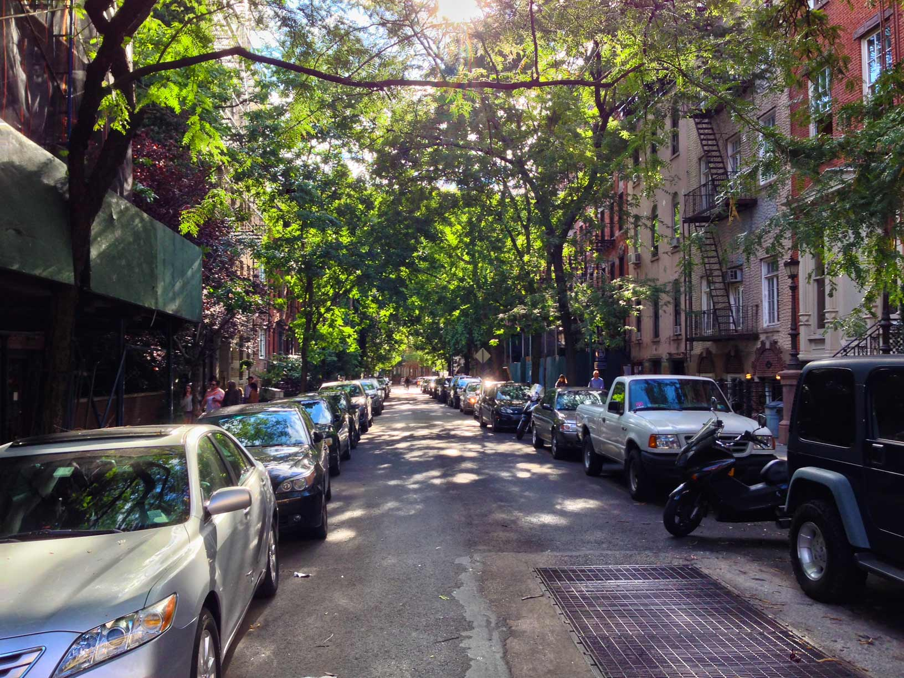
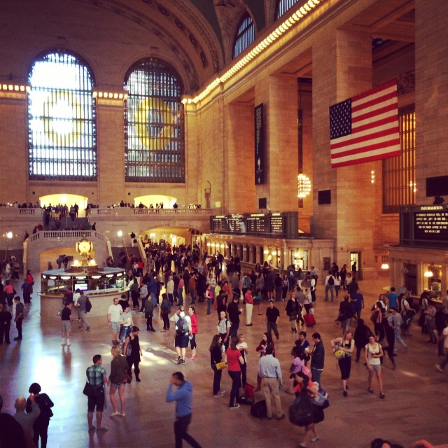
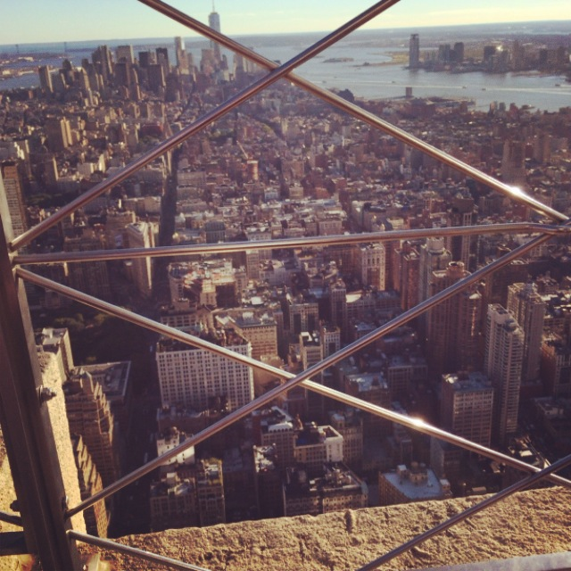
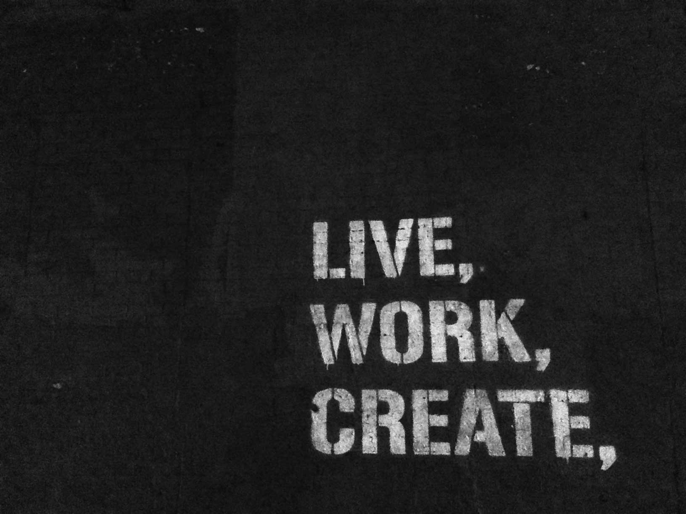
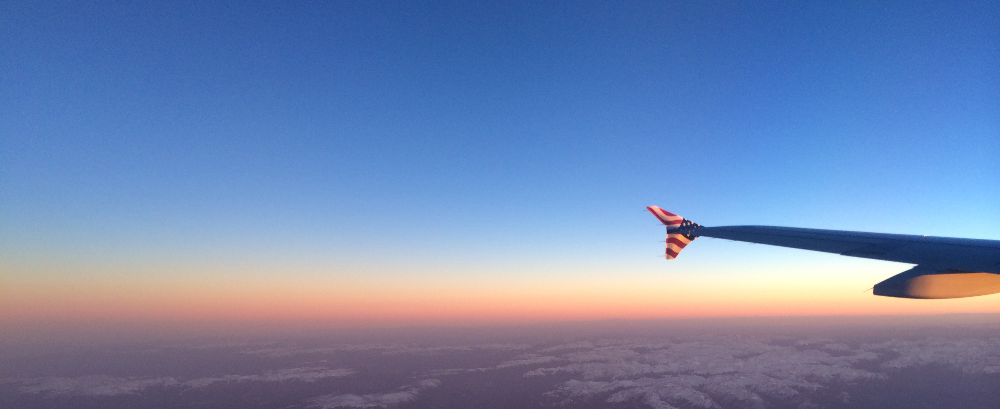

Two weeks ago I was in New York. It was amazing. The city is just as crazy as in the films and I enjoyed every moment, even though I was there for "work".

[Me](http://twitter.com/vfxguynz/), [Leanne](http://twitter.com/LeeClarry) and [Nic](http://twitter.com/gibbini) were the lucky ones from [PaperKite](http://paperkite.co.nz) that were invited to go and launch the UN Handbook app to our clients, the NZUN. We had a great time meeting the people over in New York that work for the New Zealand consulate, and we had a blast. 

We did all the tourist things apart from going to the Statue of Liberty, and managed to take some amazing photos!

</img>
</img>

</img>

There were a few highlights to the trip for myself

* Tour of the United Nations Headquarters
* Lunch in the New York Facebook HQ
* Meeting a few of the [GitHub](https://github.com) guys at Barcade in Brooklyn

Anyway check out the UN Handbook on the [Apple App Store](http://www.appstore.com/UNHandbook) and [Google Play Store](https://play.google.com/store/apps/details?id=govt.nz.mfat.UNHandbook) - it's free!
