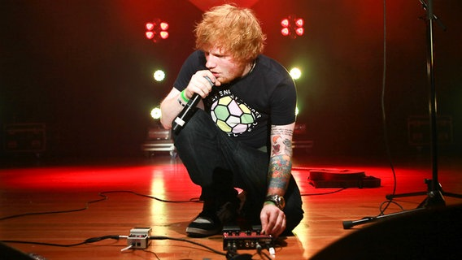
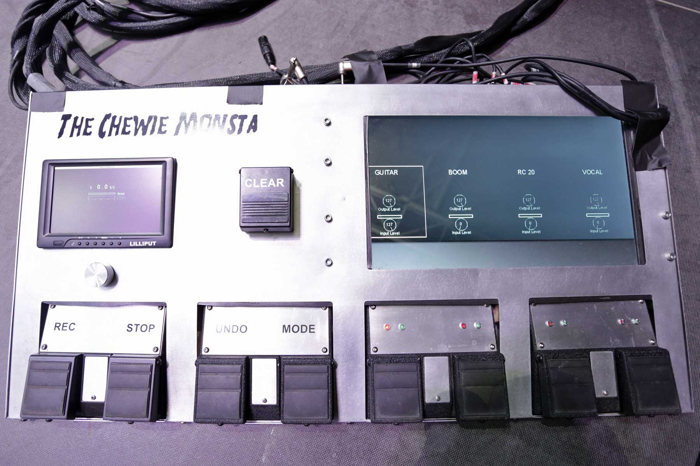
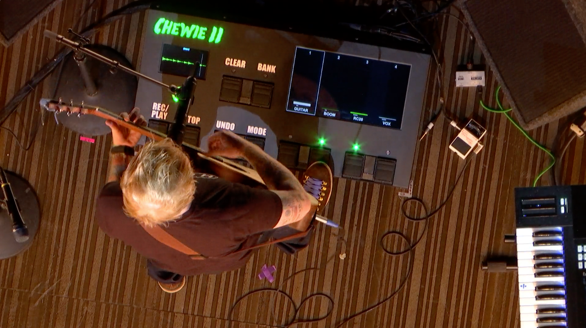
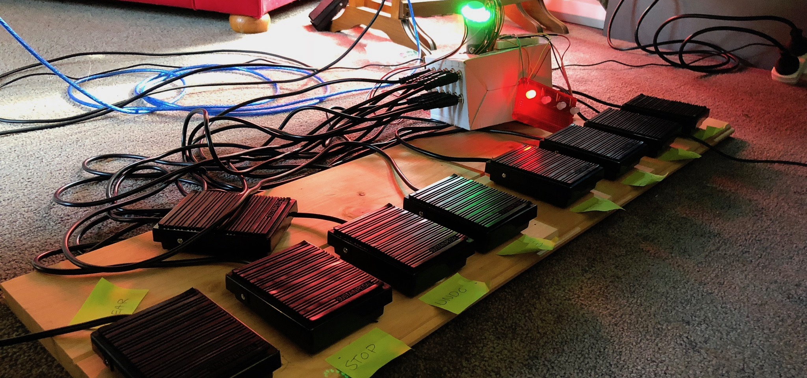

  
<a href="/2018/ls-1-loop-station">I've made more progress on this project! You can read the next post here: LS-1 Loopstation</a>
  

I've not experimented with many hardware projects before now. I've been working on a project on and off for almost a year now.

If you know me in person, you know that I think Ed Sheeran is an incredible live performer. When he came back into the spotlight in 2017 with his new album ➗ and his new loop pedal, the Chewie Monsta 2, I had to find out all I could about it!

Before we get to my project here's a little background on the Chewie Monsta, and Ed's loopers.

---

# Boss-RC 20

Ed Sheeran started out with a Boss-RC20 loop pedal. This loop pedal has two individual tracks that you can record into and then stop and start individually.

This pedal lasted a while, and sometime in 2014 Ed started his larger stadium tours, and moved to a custom designed midi controller dubbed 'The Chewie Monster".

---

# Chewie Monsta 1

This pedal controlled the Mobius VST hosted in Ableton Live. You can see the Mobuis UI on the screen on the machine. 
Each of the foot pedals look like repurposed RC-20's! I assume this is because they were familiar to Ed.

---

# Chewie Monsta 2

Look at this beast! It's a step up from version 1, the finish and new screen graphics look great!

I scoured the internet for all the videos I could find of the Chewie 2 to figure out how it works, and came up with this control system.

| Pedal | Control Mode | Action |
--- | --- | ---
Clear | Rec | Clears the current track
| - | Play | Clears everything
Bank | Rec | ?
| - | Play | ?
Rec/Play | Rec | Record -> Overdub -> Play onto the seleted track. If this records into the first track then this will become the lead loop and set the duration for the other tracks. 
| - | Play | Unmute all tracks. If all tracks are muted, then it will set the position to 0 and play.
Stop | Rec | Mute the current track
| - | Play | Mute all tracks
Undo | Rec | Undo the last recorded layer
| - | Play | Nothing?
Mode | Rec | Switch to Play mode & change any tracks that are in Overdub or Recording to Play.
| - | Play | Switch to record mode.
Track X | Rec | Select track X & Record/Overdub. If the track is in Record/Overdub it will switch to Play.
| - | Play | Play and Mute track X

---

# Custom Loop Pedal

After breaking Ed's Chewie Monsta down, I had my ideal features. There is nothing else on the market quite like it, especially for the live displays of the loop waveform that you can see in the image above. [There is an instructable for creating a similar pedal to the Chewie Monsta 1 here](http://www.instructables.com/id/DIY-Chewie-Monsta-Ed-Sheeran-Loop-Pedal/) which might suit some people.

Features I'd like to have

- Two external "presenter" views
  - Loop waveform display. Output of the currently selected loop track (the small screen on the chewie monsta)
  - Track selection + output (the large screen on the chewie monsta)
- 4 Tracks
- Each track can be overdubbed + undone
- MIDI Controllable - I have a teensy and a bunch of foot pedals.
- JS Scripting for behaviour? Allow the ability for others to customise the behaviour.

## The Software

I started out with playing around with Max, and managed to get a single track looping, overdubbing, along with a waveform display in an OpenGL window! Although I couldn't figure out how to implement undo.

<blockquote class="instagram-media" data-instgrm-captioned data-instgrm-permalink="https://www.instagram.com/p/BSYYhvgl2bs/" data-instgrm-version="8" style=" background:#FFF; border:0; border-radius:3px; box-shadow:0 0 1px 0 rgba(0,0,0,0.5),0 1px 10px 0 rgba(0,0,0,0.15); margin: 1px; max-width:658px; padding:0; width:99.375%; width:-webkit-calc(100% - 2px); width:calc(100% - 2px);">
 
 

 
 <a href="https://www.instagram.com/p/BSYYhvgl2bs/" style=" color:#000; font-family:Arial,sans-serif; font-size:14px; font-style:normal; font-weight:normal; line-height:17px; text-decoration:none; word-wrap:break-word;" target="_blank">Spent the entire day today in Max for Live. Progress on the Loop patch 👌👌 (92/365) #abletonlive #maxforlive #cycling74</a>
 
A post shared by <a href="https://www.instagram.com/wtsnz/" style=" color:#c9c8cd; font-family:Arial,sans-serif; font-size:14px; font-style:normal; font-weight:normal; line-height:17px;" target="_blank"> Will Townsend</a> (@wtsnz) on <time style=" font-family:Arial,sans-serif; font-size:14px; line-height:17px;" datetime="2017-04-02T11:17:26+00:00">Apr 2, 2017 at 4:17am PDT</time>

</blockquote> 

I took a break for a while and put this project on Ice until later in 2017 (I went travelling)

[JUCE](https://juce.com) is a C++ Audio framework that is suited for projects like this. Now, I am not a great C++ developer, but I know just enough to be dangerous. 

I started to build the Looper in C++, compile it down to be a VST/Audio unit, and host it in Ableton Live.

It wasn't a looker back then, but it proved the concept.

## The Hardware

I had got the software to a point that I needed to start thinking about the hardware side of things. I bought my first arduino in the form of a Teensy, as they're good for prototyping USB prepherials, so _they_ say.

Following a few guides on how to get the Teensy to interact with Midi, how to use buttons, and how to light up LEDs - which by the way, as a software developer, there is no feeling quite like the feeling when you get your LED to flash for the first time! 😎

Over the last few months I've gotten it to a place where it all kinda works. My laptop isn't powerful enough to run Live and stream to youtube - I like to keep a record of my playing - so that's a little unfortunate!

Now I need to put all that mess in a case, and it's time to learn how to use CAD and contact some metal fabricators..! 

I'll record a video of the loop pedal in action soon.

  

  <a href="/2018/ls-1-loop-station">I've made more progress on this project! You can read the next post here: LS-1 Loopstation</a>
  

