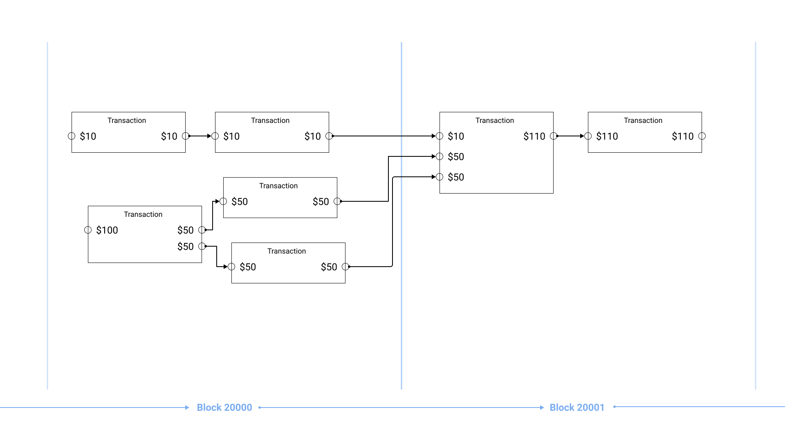

After my last [kerfuffle](/2013/bitcoins) with Bitcoin, I've been hesitant to get involved again. Along with watching the technical progress of Bitcoin over the last 7 years, its been very disappointing. If anything it's been going backwards. 

This post follows my path of explorations into smart contracts as I learn more about them - loosely following the direction I took, with links to the posts that I gained insights from.

I must say that I didn't really ever know what Bitcoin (per the whitepaper) could actually do. I also think that pretty much everyone else promoting alt coins currently have no idea what is currently possible either. 

The main disappointment was the disabling of a bunch of the op_codes that are used in the Bitcoin scripting language, and the focus on small blocks. It made no sense.

Now that Bitcoin script has been [unfucked](https://www.yours.org/content/the-unfuckening-of-op_return-b10d2c4b52da) (Bitcoin SV), we can now create smart contracts using the scripting language as originally intended by Satoshi.

1. What the hell _are_ bitcoin scripts?
1. Scripts
1. Scrypts

## What the hell _are_ bitcoin scripts?

It's taken me far to long to wrap my head around how bitcoin "works". For the longest time I had a rough idea, reading the wiki, and a few blog posts, but I'd never taken the time to actually dig in...

A very high level overview of Bitcoin: Bitcoin is essentially a very large database that stores Transactions and Blocks. Transactions are grouped into Blocks. Blocks are linked together similar to a linked list. (Hence the potentially familiar term _Block Chain_...)



A Transaction is made up of Inputs and Outputs, essentially forming a graph where each transaction is a node. The relationships between a Transactions' Outputs and Inputs are validated by a predicate; a basic script that evaluates to TRUE or FALSE.

It's this evaluation of each Input script that determines whether the transaction is valid or not (not quite... but good enough for now), and it's how the system knows that you have the permission to use/move/spend the satoshis.

Scripts are written in a Bitcoin scripting language. It's a stack based language similar to Forth. I've not used Forth before, but I was able to understand how simple scripts evaluate. I'd recommend reading a little about the scripting language [here](https://en.bitcoin.it/wiki/Script).

There are two sides to each script. We have the _Locking Script_ and the _Unlocking Script_.

**Locking Scripts**

The Locking Script can be thought of as the "destination" of an Output. You send Bitcoin by "locking them up" in a Locking Script. This is what we call a Unspent Transaction Output (UTXO).

**Unlocking Scripts**

In order to send Bitcoin somewhere you first must provide access to the UTXO, and provide the Unlocking Script that satisfies the locking script that results TRUE after executing.

A good thing to note would be that in the past, the terminology for Locking Script and Unlocking script was different. They were called `ScriptPubKey` and `ScriptSig` respectively. When you see `ScriptPubKey` think _Locking Script_, and when you see `ScriptSig` think _Unlocking Script_.


Let's look at an example at a well known Locking & Unlocking script.

### Pay-to-Public-Key-Hash (P2PKH)

If you've ever made a bitcoin transaction to send bitcoin to an address it's very likely that you created a Pay-to-Public-Key-Hash (P2PKH) script. This is one of the "standard" transactions that you'll find in Bitcoin.

The locking script for P2PKH looks like this

```
OP_DUP OP_HASH160 <Your Public Key Hash> OP_EQUAL OP_CHECKSIG
```

And the unlocking script 
```
<Your Signature> <Your Public Key>
```
To validate, the locking script and the unlocking script are combined and then evaluated.
```
Unlocking Script + Locking Script == true
```
The script must complete with `true` in order to be validated.

In the case of P2PKH, the entire script will look like this
```
<Your Signature> <Your Public Key> OP_DUP OP_HASH160 <Your Public Key Hash> OP_EQUAL OP_CHECKSIG
```
and if you've used the correct keys, then the UTXO will be validated in the transaction!

Now let's look at an example where we've wrote our own Locking & Unlocking script.

## Scripts

There are many different types of scripts one can use. As long as the combination of Locking Script and Unlocking script that results in a `true` value, it doesn't matter what the script is. 

This fact opens up a lot of possibilities for what you can do with Bitcoin scripts and is where the idea of "smart contracts" come in. In Bitcoin, a smart contract is simply a Locking Script and its corresponding Unlocking Script.

Take this Locking Script:
    ``` 
    OP_5 OP_EQUAL
    ```
This Locking Script (above) isn't secure at all. It's trivial for anyone to spend this UTXO by writing the correct Unlocking Script which would simply be
    ```
    OP_5
    ```
We can see why this is valid after combining the Locking Script and Unlocking Scripts together.
    ```
    OP_5 OP_5 OP_EQUAL
    ```
This pushes two numbers (5) to the stack and then verifies that they are equal. This evaluated to true causing the script to be valid. If we used a different number in the Unlocking Script, the combined script would not evaluate, causing the transaction to be invalid. (If this is lost on you, again I recommend reading a little more about how Bitcoin Script works [on the wiki](https://en.bitcoin.it/wiki/Script).)

I've created two transactions on the Bitcoin Test Network that demonstrate this Locking Script and Unlocking Script.

[Here is the transaction that locks 10,000 satoshis into the Locking Script](https://test.whatsonchain.com/tx/ee2b59986fc031a3d1fda6ebefec252e4d07cac60e9ca0a4f16fd4ed31f34933)

[Here is the transaction that unlocks the 10,000 satoshis and sends it back to our address](https://test.whatsonchain.com/tx/8b81c59b53e64ed51666283d4742cba04f02a9dbfca3794b517ba4a387c5fc66)

The code that was used to create these transactions is available [here](https://github.com/wtsnz/bitcoin-transaction-demos/blob/main/scripts/basicCustomScript.js) for reference.

## sCrypt

Writing scripts using the OP Codes as we have done above can only get you so far. Xiaohui Liu has created the [sCrypt language](https://scryptdoc.readthedocs.io/en/latest/). From the docs:

> sCrypt (pronounced “ess crypt”) is a high-level smart contract language for Bitcoin SV. Bitcoin supports smart contract with its Forth-like stack based Script language. However writing smart contract in native Script is cumbersome and error-prone. It quickly becomes intractable when the contract size and complexity grow.

If you've used Solidity on Ethereum, then you have a slight advantage as the syntax is similar to writing Solidity scripts.

We can write smart contracts in sCrypt that are then compiled down to the bitcoin OP Codes in order to make more advanced scripts in a higher level language. Let's take a look.

### Re-writing our EqualsFive script in sCrypt

To write the above contract in sCrypt, it would look something like this:

```scrypt
contract EqualsFive {
  public function isFive(int x) {
      require(x == 5);
  }
}
```

This is a very simple contract that can be unlocked if the value we provide is equal to `5`. While this isn't a very useful contract, it's enlightening to see what it would look like in sCrypt.


```js
// Compile the contract
const EqualsFive = buildContractClass(loadDesc('equalsFive_desc.json'));
equalsFive = new EqualsFive();

// Generate the locking script
const lockingScript = equalsFive.lockingScript

// Generate the Unlocking Script
const unlockingScript = equalsFive.isFive(5).toScript()
```

Which results in the compiled Locking Script:

```
OP_0 OP_PICK OP_5 OP_NUMEQUAL OP_NIP
```

> This locking script is slightly different to the one we wrote by hand due to the way sCrypt has compiled the EqualsFive contract. It looks different, but works the exact same way.

And the compiled Unlocking Script:
```
OP_5
```

Which when executed:

```
OP_5 OP_0 OP_PICK OP_5 OP_NUMEQUAL OP_NIP
```

Just like our hand written script, when this is executed, it returns `true`, thus being validated.

From here on out, the contracts start to get a little more involved.

---

### OP_PUSH_TX

I know what you're thinking, that's all good and well, but there is no way that you can use any 'state' in these scripts.

That would be a wrong stance to take. **You certainly can use state in Bitcoin Scripts**. There's a little known method that allows us to do just that.

We can make use of a pseudo operation dubbed [`OP_PUSH_TX`](https://medium.com/@xiaohuiliu/op-push-tx-3d3d279174c1) which allows us to access the 'current' transaction. The _current_ transaction being the transaction in which is being validated. This is a mind bending concept - we put the current transaction inside the unlocking script of the current transaction. How does that work!? 

I severely recommend reading the [post that introduces this idea](https://medium.com/@xiaohuiliu/op-push-tx-3d3d279174c1) a couple of times. It took me a while to understand what was happening, and _how_ we can even do so!

With that in mind, and the myth busted, we can now accept that we have the ability to read and write state in Bitcoin Transactions.

### Counter Example

To demonstrate these concepts, sCrypt comes with a Counter contract that stores the current number of times the contract has been executed. Again, I'm going to defer you to the short [sCrypt post that describes this contract here](https://medium.com/coinmonks/stateful-smart-contracts-on-bitcoin-sv-c24f83a0f783). Take a minute to read that, and then come back. I'll wait!

This contract places the following requirements on the outputs:

- the locking script code must be equal to what it was before
- the counter value stored in an integer after the locking code must increment by one

```scrypt
contract Counter {
	public function increment(SigHashPreimage txPreimage, int amount) {
        require(Tx.checkPreimage(txPreimage));

        bytes scriptCode = Util.scriptCode(txPreimage);
		int scriptLen = len(scriptCode);
		
		// state (i.e., counter value) is at the end
		int counter = unpack(scriptCode[scriptLen - Util.DataLen :]);
		// increment counter
		bytes scriptCode_ = scriptCode[: scriptLen - Util.DataLen] + num2bin(counter + 1, Util.DataLen);
		bytes output = Util.buildOutput(scriptCode_, amount);
		// ensure output is expected: amount is same with specified
		// also output script is the same with scriptCode except counter incremented
		require(hash256(output) == Util.hashOutputs(txPreimage));
    }
}
```

Please read the post that explains this far better than I can [here](https://medium.com/coinmonks/stateful-smart-contracts-on-bitcoin-sv-c24f83a0f783).

### Advanced Counter Example

Taking the Counter example further.. 

In the example Counter Contract above, the transaction fee is paid by the Contract itself, limiting its life to the lengths the initial value can cover the transaction costs. How can we make sure that this Contract lives forever?

The Advanced Counter example shows how you can make changes to the Contract so that you can add additional inputs and outputs into the transaction so that the caller has to pay for the transaction fee, and still validate the transaction in script.

It also has a requirement that the balance inside the Contract stays the same, causing the satoshi value locked inside this contract to stay there forever. 

Once deployed, Contracts like this one are final because it contains a requirement that the Locking Script is the same as before. To enable you to retrieve the funds, you have to add a function in the Contract _before_ deploying it. This is why we have the testnet!

Again, please read [this post that explains the Advanced Counter Example](https://medium.com/@xiaohuiliu/advanced-op-push-tx-78ce84f69a66).


### A demo scrypt

I'm using [Scrypt](https://scryptdoc.readthedocs.io). Scrypt is a high-level smart contract language (similar to ethereum's Solidity) that compiles down to the Bitcoin assembly code.

There is a demo contract in the sCrypt project.

```scrypt
contract Demo {
  int x;
  int y;

  constructor(int x, int y) {
      this.x = x;
      this.y = y;
  }

  function sum(int a, int b): int {
      return a + b;
  }

  public function add(int z) {
      require(z == this.sum(this.x, this.y));
  }

  public function sub(int z) {
      require(z == this.x - this.y);
  }
}
```

This demo scrypt will compile down to a Locking Script and Unlocking Scripts. The Locking Script is derrived from the constructor, and the Unlocking Scripts are derrived from the public functions.

This demo script is essentially a logic puzzle. You'd be able to reverse engineer the compiled Locking Script (looking at the op codes) and figure out how to create a valid unlocking script that would make a valid transaction.

To create a transaction that uses this demo scrypt, we'd use the `scryptlib` javascript library to compiled the script. We then create an output with the compiled Locking Script and broadcast the transaction.

To unlock the UTXO we just made, we create another transaction using the UTXO and the Demo Contracts Unlocking script.

```js
const amount = 2000
const newAmount = 546

// Compile the contract
const Demo = buildContractClass(loadDesc('demo_desc.json'));
demo = new Demo(4, 7);

// Lock funds into the script.
const lockingTx =  await createLockingTx(privateKey.toAddress(), amount)
lockingTx.outputs[0].setScript(demo.lockingScript)
lockingTx.sign(privateKey)
const lockingTxid = await sendTx(lockingTx) // Broadcast the transaction

// Unlock the funds we just locked in using the Contracts Unlocking Script
const unlockingScript = demo.add(11).toScript()
const unlockingTx = await createUnlockingTx(lockingTxid, amount, demo.lockingScript.toASM(), newAmount)
unlockingTx.inputs[0].setScript(unlockingScript)
const unlockingTxid = await sendTx(unlockingTx)
```


## Learning from existing example scripts


- demo.scrypt
  - Introduces the concept of scripts. Locking script & unlocking scripts. It's taken me longer than I want to admit to wrap my head around how these fit together, and where they're located in a transaction.
- counter.scrypt
  - Introduces the concept of stateful scripts using the `preimage` of a staged transaction. This allows the unlocking script to access the transaction that is spending the input (locking script).
- advancedCounter.scrypt
  - Introduces the concept of paying the transaction fee from another input. Expecting one change output, and verifies that the amount in the counter is the same going forward, that the output script is the same, but with an incremented counter value.


Sentences that helped wrap my head around how contracts work on bitcoin. I stared at these for a while.

- You lock funds into a scripthash (locking script)
- You unlock funds by providing the unlocking script (contract function) to the outpoint in the spending transactions. (The scriptsig)
- The contract is simply the unlocking script of a previous transactions outpoint.


There are two parts to the script that is evaluated when validating a Transaction. When you "send" bitcoin, you're unlocking the satoshis using an Unlocking Script (source), and locking them up in a Locking Script (destination). The locking script is associated with an output in a transaction. Its job is to set the conditions in which the output can be used in a future transaction. The unlocking script should satisfy the outputs' locking script. When spending an UTXO, you must provide the unlocking script for the transaction to be valid.

Each output has a script (locking script) associated with it. This script prevents just anyone being able to use the unspent output (UTXO) in a later transaction. This locking script is then unlocked by the unlocking script provided when spending the UTXO in a later transaction.


# Go forth and conquer!

If you're a smart contract developer that has wrote solidity contracts for Ethereum, give Bitcoin another go now that it's been reverted to the original implementation (Bitcoin SV). You never know; you might be surprised with what you can do.

[Scrypt: High level smart contract language (like solidity)](https://scryptdoc.readthedocs.io/en/latest/)

**Bonus:** Also, get ready for a token explosion powered by Bitcoin SV. Matterpool have been working on a Non-Fungible-Token smart contract using native bitcoin script. Check that out here https://www.npmjs.com/package/@matterpool/superasset-js.