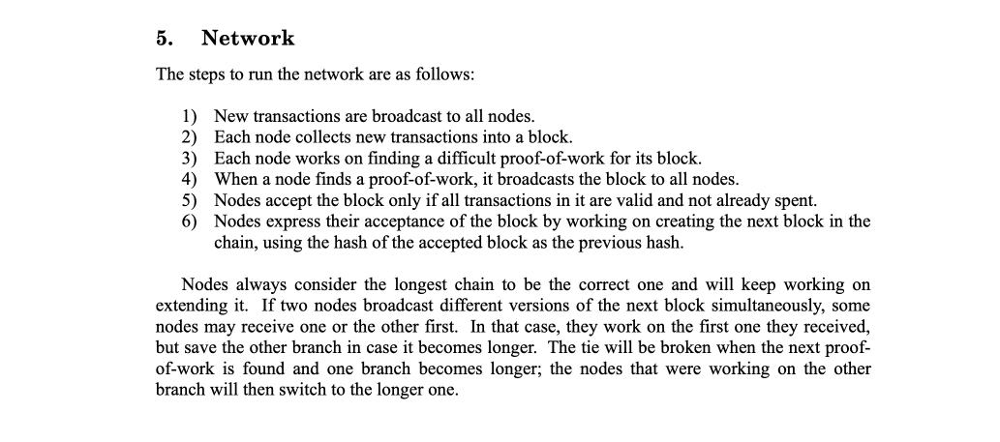

I’m writing this short post to clear up a lot of misconceptions about “mining” Bitcoin that I often see online. There is a strong narrative in the Bitcoin Core world that you have to run your own Bitcoin Core Node in order to "help" the network be "decentralized" and "validate your transactions" so you can _#BeYourOwnBank_…

 🤮

This is complete bull crap.

To say it simply; you are not contributing to the network in any way if your node doesn't mine and create blocks. Let me ask you this. What happens if your Raspberry Pi BTC node detects an invalid transaction and rejects the block that contains it? Have a think.

Your Raspberry Pi Node will stall. It can't do anything else other than attempt to connect to another node, request the latest block(s) and attempt to validate. As soon as your node disagrees with the network your Node just sits there doing nothing, unable to sync to the longest chain.

**The only nodes that matter are the nodes that are actively mining**. They're the nodes in the business of making money. If these mining nodes process a block that your Raspberry Pi node disagrees with nothing happens. Mining _is_ the consensus method, its not good enough to simply run a non-mining node.

How does running your own non-mining node contribute to the network? If anything it reduces the efficiency of the network. Transaction propagation time - the time it takes for a transaction to "sink into" the network and reach all miners - increases due to the large number of low performance non-mining nodes.

This is clear in the [Bitcoin whitepaper](https://bitcoin.org/bitcoin.pdf):

The whitepaper defines a node using 6 points. This is the key point:

> Nodes express their acceptance of the block by working on creating the next block in the chain, using the hash of the accepted block as the previous hash.

In other words, in order to validate and accept a block (and it’s transactions contained within) you have to be working on producing the next block. This happens with the proof-of-work algorithm (Chapter 4 of the whitepaper) and is the part that is called mining.

_It's also interesting to note that the whitepaper doesn't mention mining once; It doesn't define a difference between a Node that mines, and a Node that doesn't. All nodes mine._