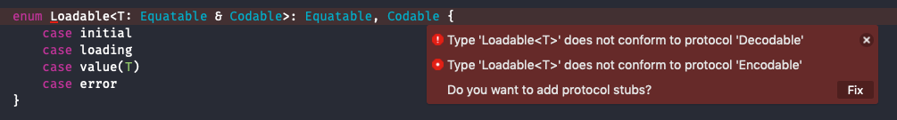

I've been writing an app using [ReSwift](https://github.com/ReSwift/ReSwift) recently and one feature that I've found quite cool is the ability to archive the entire App's state so it can be hydrated later. The most straightforward way to do this is to make your AppState conform the the `Codeable` protocol and save it to disk using the `JSONEncoder`.

There was one tricky situation that I had to work around. The app shows a list of items that are fetched from the network and these items are stored in the AppState. Because this list of items is fetched from the network (or from a remote) this list has four distinct states. The list could have not attempted to have been fetched yet (unintialized), it could be loading, it could be loaded (with our value), or it could have failed.

As there are four distinct states, this is a natural candidate to be modeled using a Swift Enum.

```swift
enum Loadable<T: Equatable, Codable>: Equatable, Codable {
    case initial
    case loading
    case value(T)
    case error
}
```

_I've ignored the associated error value for now_

We've added the `Codable` protocol as we'd like to be able to encode and decode this value, although unfortunately the compiler complains about this...



There's the one issue when trying to make this enum conform to `Codeable`, and it's that associated variable in the `.value` case. Swift doesn't automatically do the work for us to generate the functions required for conformance to the Codable protocol. We have to do it ourselves.

There is a [proposal on the Swift Forums](https://forums.swift.org/t/automatic-codable-conformance-for-enums-with-associated-values-that-themselves-conform-to-codable/11499/16) pitching to add this to the language, but as it's not yet been implemented we'll borrow the implementation suggestion from the forum post for the time being.

This proposes a possible way to add automatic conformance for Codable Enums that have associated variables. 

```swift
extension Loadable: Codable {

    enum Discriminator: String, Codable, CodingKey {
        case initial
        case loading
        case value
        case error
    }

    enum CodingKeys: String, CodingKey {
        case discriminator
        case value_value // 😅
    }

    func encode(to encoder: Encoder) throws {
        var container = encoder.container(keyedBy: CodingKeys.self)

        switch self {
        case .initial:
            try container.encode(Discriminator.initial, forKey: .discriminator)
        case .loading:
            try container.encode(Discriminator.loading, forKey: .discriminator)
        case .value(let value):
            try container.encode(Discriminator.value, forKey: .discriminator)
            try container.encode(value, forKey: .value_value)
        case .error:
            try container.encode(Discriminator.error, forKey: .discriminator)
        }
    }

    init(from decoder: Decoder) throws {
        let container = try decoder.container(keyedBy: CodingKeys.self)
        let discriminator = try container.decode(Discriminator.self, forKey: CodingKeys.discriminator)

        switch discriminator {
        case .initial:
            self = .initial
        case .loading:
            self = .loading
        case .value:
            let value = try container.decode(T.self, forKey: .value_value)
            self = .value(value)
        case .error:
            self = .error
        }
    }
}
```

Once adding this, the compiler errors will be fixed and we can encode and decode our state!

Hope this helps!