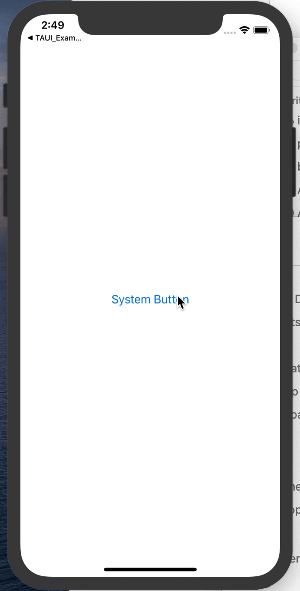
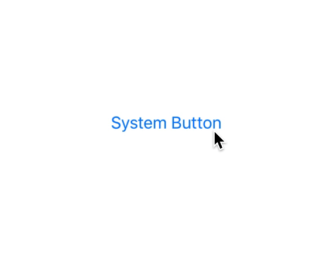
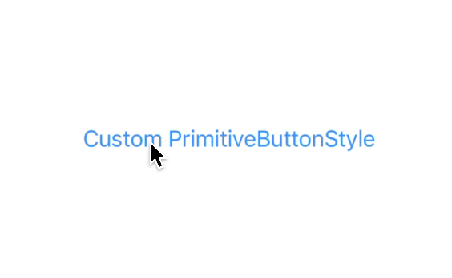
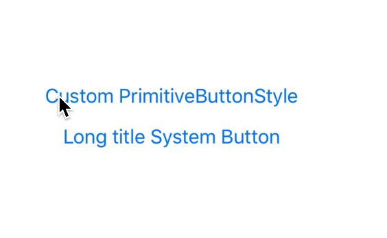
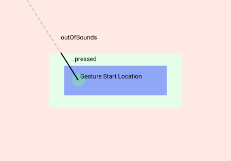
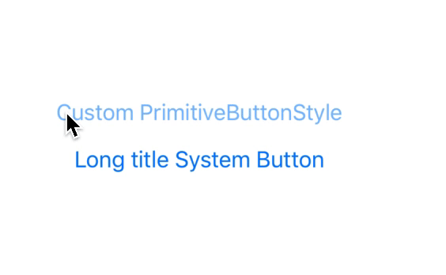

I've recently been diving into SwiftUI in a new project. Overall it's been a great experience - it feels good to learn everything over with a fresh slate! Although slightly frustrating with the current state of the documentation.

Today I'll explain how to create your own Button Styles, and hopefully show you the difference between `ButtonStyle` and `PrimitiveButtonStyle`, and why you'd use one or the others.

Let's have a look at the behaviour of the `Button` view that is provided.

<table>
<tr>
<th>
Code
</th>
<th>
Result
</th>
</tr>
<tr>
<td>

```swift
Button("System Button") {
    print("tapped")
    return
}
```

```swift
Button("System Button") {
    print("tapped")
    return
}
.disabled(true)
```

</td>

<td>



</td>

</tr>
</table>

So looking closely at the button, you can see there are a couple of states:

- Normal
- Pressed
- Disabled (not shown)

And you can also see the behaviour that the Button view provides while pressing and dragging around the view. Drag too far and the button looses it's Pressed state, drag your finger closer again and it becomes pressed again. This small detail is extremely important, as it allows you to cancel the buttons trigger by moving your finger away from the button you pressed.

---

### The different Button Styles

In SwiftUI we have the concept of Styles. Styles allow any View to provide a modifier that can customise the appearance and the interaction behaviour of the view.

In our case, Button has two defined ways of creating a custom Style.

- [ButtonStyle](https://developer.apple.com/documentation/swiftui/buttonstyle)
- [PrimitiveButtonStyle](https://developer.apple.com/documentation/swiftui/primitivebuttonstyle)

While the documentation is missing (check the headers instead - they're brief, but I'll take what I can), these Button Style use cases boil down to:

- Use the `ButtonStyle` when you want to simply change the appearance based on whether the button `isPressed` or not. 
- Use the `PrimitiveButtonStyle` when you want to control when/how the button triggers it's action. There is no `isPressed` property in the `PrimitiveButtonStyle`, so it can be more flexible, at the cost of a little more work.

### Creating a custom ButtonStyle

Let's pose the desire to add a scale down effect when we press a Button. To add a scaling effect when the button is pressed we want to use the `ButtonStyle`. 

Implementing the `ButtonStyle` protocol will look something like the folowing:

```swift
struct ScaleButtonStyle: ButtonStyle {

    var scaleAmount: CGFloat

    func makeBody(configuration: Self.Configuration) -> some View {
        ScaleButton(
            configuration: configuration,
            scaleAmount: scaleAmount
        )
    }
}

private extension ScaleButtonStyle {
    struct ScaleButton: View {

        @Environment(\.isEnabled) var isEnabled

        let configuration: ScaleButtonStyle.Configuration
        let scaleAmount: CGFloat

        var body: some View {
            return configuration.label
                .foregroundColor(isEnabled ? .blue : .gray)
                .padding(15)
                .opacity(configuration.isPressed ? 0.5 : 1.0)
                .scaleEffect(configuration.isPressed ? scaleAmount : 1.0)
        }
    }
}
```

And we'll use by calling the `.buttonStyle()` modifier on a Button.

<table>
<tr>
<th>
Code
</th>
<th>
Result
</th>
</tr>
<tr>
<td>

```swift
Button("System Button") {
    print("tapped")
    return
}
.buttonStyle(
    ScaleButtonStyle(scaleAmount: 0.98)
)
```

</td>

<td>



</td>

</tr>
</table>

Looks great! 

<br />

### Creating a custom PrimitiveButtonStyle

Implementing the same style using a `PrimitiveButtonStyle` takes a lot more work. This is because when we use the `PrimitiveButtonStyle` we have to trigger the Button's Action block ourselves. To borrow a paragraph from the SwiftUI comments:

> `Button` instances built using a `ButtonStyle` will use the standard button interaction behavior (defined per-platform). To create a button with custom interaction behavior, use `PrimitiveButtonStyle` instead.

The `PrimitiveButtonStyle.Configuration` only provides us with the Button's `trigger()` (the Action block), nothing else, no `isPressed` property to indicate when the button is pressed. 

Implementing the `PrimitiveButtonStyle` requires us to do the work to detect and call the `trigger()` when we consider our custom button tapped. To do this, we have to add a Gesture to the `label` inside our body view in order to detect taps. To match the default system behaviour, remember what I explained above about the behaviour of Button:

> And you can also see the behaviour that the Button view provides while pressing and dragging around the view. Drag too far and the button looses it's Pressed state, drag your finger closer again and it becomes pressed again. This small detail is extremely important, as it allows you to cancel the buttons trigger by moving your finger away from the button you pressed.

You don't get this for free with any built in Gesture (as far as I'm aware) - we have to build this behaviour ourselves. This ends up being the majority of the code we'll write for this version of our `PrimitiveButtonStyle` version.

```swift
struct PrimitiveScaleButton: PrimitiveButtonStyle {

    func makeBody(configuration: Self.Configuration) -> some View {
        ScaleButton(configuration: configuration, scaleAmount: 0.98)
    }

}

private extension PrimitiveScaleButton {
    struct ScaleButton: View {

        private enum ButtonGestureState {
            case inactive
            case pressing
            case outOfBounds

            var isPressed: Bool {
                switch self {
                case .pressing:
                    return true
                default:
                    return false
                }
            }
        }

        @Environment(\.isEnabled) var isEnabled
        @GestureState private var dragState = ButtonGestureState.inactive
        @State private var isPressed = false

        let configuration: PrimitiveScaleButton.Configuration
        let scaleAmount: CGFloat

        var body: some View {
            let dragGesture = DragGesture(minimumDistance: 0)
                .updating($dragState, body: { value, state, transaction in
                    let distance = sqrt(
                        abs(value.translation.height) + abs(value.translation.width)
                    )

                    if distance > 10 {
                        state = .outOfBounds
                    } else {
                        state = .pressing
                    }
                })
                .onChanged({ value in
                    withAnimation(.easeInOut(duration: 0.16)) {
                        self.isPressed = self.dragState.isPressed
                    }
                })
                .onEnded { _ in
                    if self.isPressed {
                        self.configuration.trigger()
                    }

                    withAnimation(.easeInOut(duration: 0.16)) {
                        self.isPressed = self.dragState.isPressed
                    }
                }

            return configuration.label
                .gesture(dragGesture)
                .foregroundColor(isEnabled ? .blue : .gray)
                .padding(15)
                .opacity(isPressed ? 0.5 : 1.0)
                .scaleEffect(isPressed ? scaleAmount : 1.0)
        }
    }
}
```

This mimics the built in Button effect fairly well. You can press, move your finger away from the button to 'un-press' the button, and move it closer again to press it again. 

Implementing a custom button style with the `PrimitiveButtonStyle` allows you to change not just the _appearance_ of the Button, but the _**interaction**_ of it. That is the difference between the `ButtonStyle` and the `PrimitiveButtonStyle`.

<br />

<table>
<tr>
<th>
Code
</th>
<th>
Result
</th>
</tr>
<tr>
<td>

```swift
Button("Custom PrimitiveButtonStyle") {
    print("tapped")
    return
}
.buttonStyle(PrimitiveScaleButton())
```

</td>

<td>



</td>

</tr>
</table>

This implementation, while close to the default system style isn't quite right. As you can see when pressing on the far left side of the button, and then dragging to the right hand side, our implementation 'un-presses' the button, while the system one doesn't. We'll have to take into account the size of our button in the gesture logic.

<table>
<tr>
<th>
Code
</th>
<th>
Result
</th>
</tr>
<tr>
<td>

```swift
Button("Custom PrimitiveButtonStyle") {
    print("tapped")
    return
}
.buttonStyle(PrimitiveScaleButton())

Button("Long title System Button") {
    print("tapped")
    return
}
```

</td>

<td>



</td>

</tr>
</table>

It's the little things.

---

To pull off this little interaction, we have to introduce another SwiftUI feature; [_Preferences_](https://developer.apple.com/documentation/swiftui/view/3278633-preference). Preferences are not documented in the slightest, but [swiftui-lab.com](https://swiftui-lab.com/communicating-with-the-view-tree-part-1/) have a fantastic article that introduces the concept.

Currently the way we have setup the gesture handler to recognise when the users drag is out of bounds is based upon the total translation of the drag. This would be equvilant to `startPoint - endPoint`. This doesn't take into account the actual size of the Button, which causes our gesture state to be set to `.outOfBounds` when we don't know for certain if it is.

What we can do instead, is take the frame of the Button, apply a negative inset to get a larger CGRect that extends the frame by 40 points, and check if our current gesture location is inside this larger rect.

The image below visually shows what I'm attempting to explain. 

- Blue box is our Button bounds
- Green Box is where we want the user to be able to drag their finger and the button stay 'pressed'
- Red area is where the gesture will change state to `.outOfBounds`



Thing is, to get the frame of the Button (well, the buttons Label view) we have to use a `PreferenceKey` that measures the size of the label, add an `onPreferenceChange` to update our local state so that we can access this value inside our gesture `.updating` function.

That was a lot, so I've highlighted the lines in the snippet below. Replacing our `ScaleButton` implementation with the following achieves the effect we're looking for.

```swift
private extension PrimitiveScaleButton {
    struct ScaleButton: View {

        private enum ButtonGestureState {
            case inactive
            case pressing
            case outOfBounds

            var isPressed: Bool {
                switch self {
                case .pressing:
                    return true
                default:
                    return false
                }
            }
        }

        @GestureState private var dragState = ButtonGestureState.inactive
        @State private var isPressed = false
        @State private var labelFrame: CGRect = .zero // highlight-line

        let configuration: PrimitiveScaleButton.Configuration
        let scaleAmount: CGFloat

        var body: some View {
            let dragGesture = DragGesture(minimumDistance: 0)
                .updating($dragState, body: { value, state, transaction in
                    // highlight-start
                    let amount: CGFloat = -40 
                    let touchBounds = self.labelFrame.inset(by: UIEdgeInsets(top: amount, left: amount, bottom: amount, right: amount))

                    if touchBounds.contains(value.location) {
                        state = .pressing
                    } else {
                        state = .outOfBounds
                    }
                    // highlight-end
                })
                .onChanged({ value in
                    withAnimation(.easeInOut(duration: 0.16)) {
                        self.isPressed = self.dragState.isPressed
                    }
                })
                .onEnded { _ in
                    if self.isPressed {
                        self.configuration.trigger()
                    }

                    withAnimation(.easeInOut(duration: 0.16)) {
                        self.isPressed = self.dragState.isPressed
                    }
                }

            return configuration.label
                .padding(15)
                .background(MyCustomButtonLabelBoundsPreferenceViewSetter()) // highlight-line
                .gesture(dragGesture)
                .foregroundColor(.blue)
                .opacity(isPressed ? 0.5 : 1.0)
                .scaleEffect(isPressed ? scaleAmount : 1.0)
                // highlight-start
                .onPreferenceChange(MyCustomButtonLabelBoundsPreferenceKey.self) { preferences in
                    self.labelFrame = preferences
                }
                // highlight-end
        }
    }

    // highlight-start
    struct MyCustomButtonLabelBoundsPreferenceKey: PreferenceKey {
        typealias Value = CGRect

        static var defaultValue: CGRect = .zero

        static func reduce(value: inout CGRect, nextValue: () -> CGRect) {
            value = nextValue()
        }
    }

    struct MyCustomButtonLabelBoundsPreferenceViewSetter: View {
        var body: some View {
            GeometryReader { geometry in
                Rectangle()
                    .fill(Color.clear)
                    .preference(
                        key: MyCustomButtonLabelBoundsPreferenceKey.self,
                        value: geometry.frame(in: .local)
                )
            }
        }
    }
    // highlight-end

}
```

Whew! A lot of work. Now take a look at the interaction behaviour when compared to the default Button:



Looks good!

Thanks for reading, hopefully this helped.
In the next couple of posts, I'm going to explain **_why_** you might want to know how to implement this interaction behaviour yourself from scratch using the `PrimitiveButtonStyle`, instead of simply using the `ButtonStyle` and getting this behaviour for free.

---